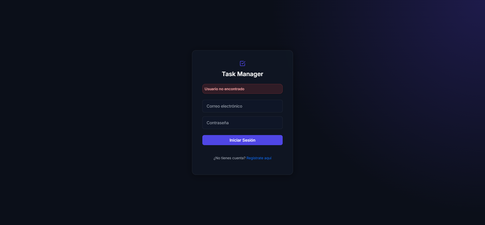
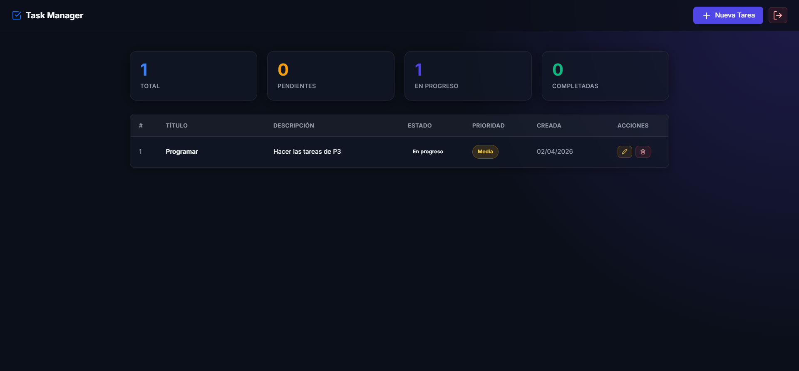
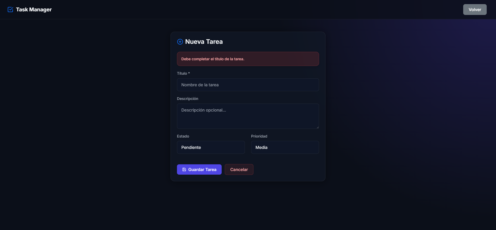
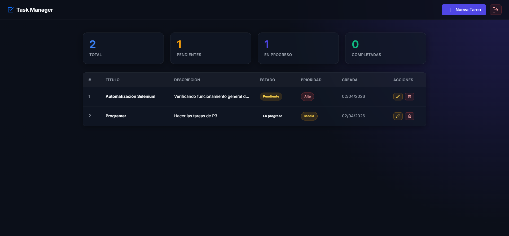
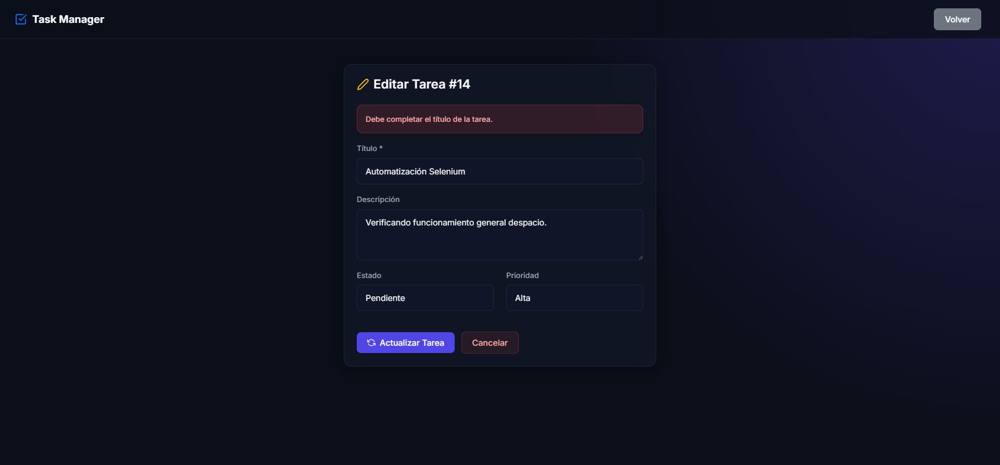
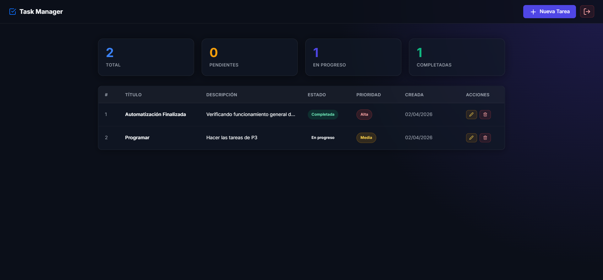
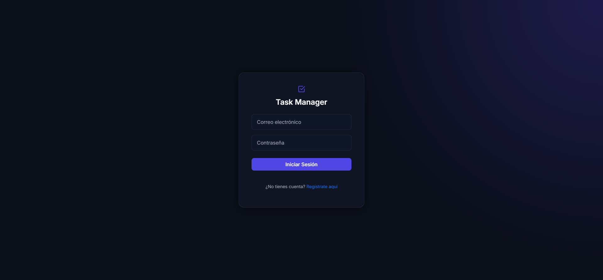

# 📝 Task Manager v2


Task Manager v2 es una aplicación web moderna orientada a la gestión de tareas, ofreciendo una experiencia de usuario fluida, intuitiva y dinámica.

Destaca por estar construida con seguridad en mente (prevención contra Inyección SQL) y por contar con una **suite completa de pruebas automatizadas E2E** utilizando Python y Selenium.

---

## ✨ Características Principales

- **Gestión de Tareas (CRUD completo):** Creación, lectura, actualización y eliminación de tareas.
- **Detalles Organizados:** Clasificación por Estados, Prioridades y Fechas de Creación.
- **Autenticación de Usuarios:** Registro e inicio de sesión seguros (protección avanzada contra SQL Injection y almacenamiento seguro de contraseñas).
- **Diseño Responsivo:** Interfaz moderna y adaptable, ofreciendo una experiencia nativa en dispositivos móviles, tablets y escritorios.
- **Alertas y Confirmaciones Interactivas:** Uso de modales personalizados para confirmar acciones destructivas (ej. eliminar tareas).

---

## 🛠️ Tecnologías y Herramientas

**Frontend:**
- HTML5 & CSS3
- JavaScript Vanilla

**Backend & Base de Datos:**
- PHP (Lógica del servidor, autenticación y manejo de sesiones)
- MySQL (Base de datos estructurada)
- PDO (PHP Data Objects para consultas seguras y prevención de inyecciones)

**Testing E2E (Quality Assurance):**
- Python 3
- Selenium WebDriver
- PyTest (para la ejecución de los tests y generación de reportes automáticos en HTML)

---

## ⚙️ Requisitos Previos

Asegúrate de contar con las siguientes herramientas en tu entorno local:

- **Servidor Local:** [XAMPP](https://www.apachefriends.org/es/index.html), WAMP, o equivalente (que incluya Apache y MySQL instalados activamente).
- **Python 3+**: Necesario para ejecutar la suite de automatización de pruebas.
- **Navegador Web:** Google Chrome (junto con ChromeDriver si no usas WebDriver-Manager).

---

## 🚀 Instalación y Configuración Local

**1. Clonar el repositorio**
```bash
git clone https://github.com/anthonygzm/Task-Manager.git
cd Task-Managerv2
```

**2. Mover el proyecto al servidor web**
- Mueve la carpeta del proyecto a la carpeta raíz de tu servidor local (por ejemplo `C:\xampp\htdocs\Task-Manager` en el caso de XAMPP).

**3. Configurar la Base de Datos MySQL**
- Abre phpMyAdmin o tu gestor de base de datos preferido.
- Crea una base de datos llamada `task_manager`.
- Ejecuta el script SQL suministrado para crear las tablas necesarias:
  ```bash
  # Importa o ejecuta el contenido de:
  database.sql
  ```

**4. Iniciar la Aplicación**
- Abre tu navegador y dirígete a `http://localhost/Task-Manager`.
- Crea una cuenta nueva y loguéate para explorar el dashboard.

---

## 🧪 Pruebas Automatizadas E2E (Selenium)

Este proyecto incluye una suite de pruebas unificadas para garantizar la calidad en los flujos principales (User Stories).

**Preparar el entorno virtual (Recomendado)**
```bash
cd tests_selenium
python -m venv .venv

# Activar en Windows
.venv\Scripts\activate
# Activar en Mac/Linux
source .venv/bin/activate
```

**Instalar dependencias necesarias**
```bash
pip install -r requirements.txt
# O alternativamente: pip install selenium pytest pytest-html
```

**Ejecutar la suite completa y generar el reporte**
Esta ejecución correrá el login, la creación, lectura, actualización y borrado de tareas.
```bash
pytest --html=report.html --self-contained-html
```
*Tras finalizar, puedes abrir el archivo `report.html` en tu navegador y ver el reporte detallado de resultados.*

---

## 📂 Estructura del Proyecto

```text
📁 Task-Managerv2
 ├── 📁 assets/          # Archivos CSS e Imágenes/Íconos
 ├── 📁 auth/            # Lógica de Inicio de Sesión y Registro
 ├── 📁 config/          # Conexiones a la DB (PDO) y configuraciones base
 ├── 📁 tasks/           # Lógica dedicada a CRUD de tareas (Crear, Editar, Eliminar)
 ├── 📁 tests_selenium/  # Suite completa de Tests en Python (Selenium Pytest)
 │   ├── test_1_login.py
 │   ├── test_2_create_task.py
 │   └── ... 
 ├── 📄 dashboard.php    # Vista principal de usuario (Panel de control)
 ├── 📄 index.php        # Punto inicial / Redirecciones
 └── 📄 database.sql     # Script de inicialización de la Base de Datos
```

---

## Screenshots

### Test 01 - Login flujo negativo


---

### Test 02 - Login flujo positivo


---

### Test 03 - Crear tarea flujo negativo


---

### Test 04 - Crear tarea flujo positivo


---

### Test 05 - Ver dashboard flujo positivo


---

### Test 06 - Actualizar tarea flujo negativo


---

### Test 07 - Actualizar tarea flujo positivo


---

### Test 08 - Eliminar tarea flujo positivo


---

### Test 09 - Logout flujo positivo


---

### Test 10 - Protección de rutas flujo negativo


## 👨‍💻 Autor

- **Anthony Guzman / 2023-1182**
- **GitHub**: [@AnthonyGzm](https://github.com/anthonygzm)
- **LinkedIn**: [Anthony Guzman](linkedin.com/in/anthonyguzm/)

---

> _"Construyendo aplicaciones confiables mediante desarrollo sólido y pruebas automatizadas"_
